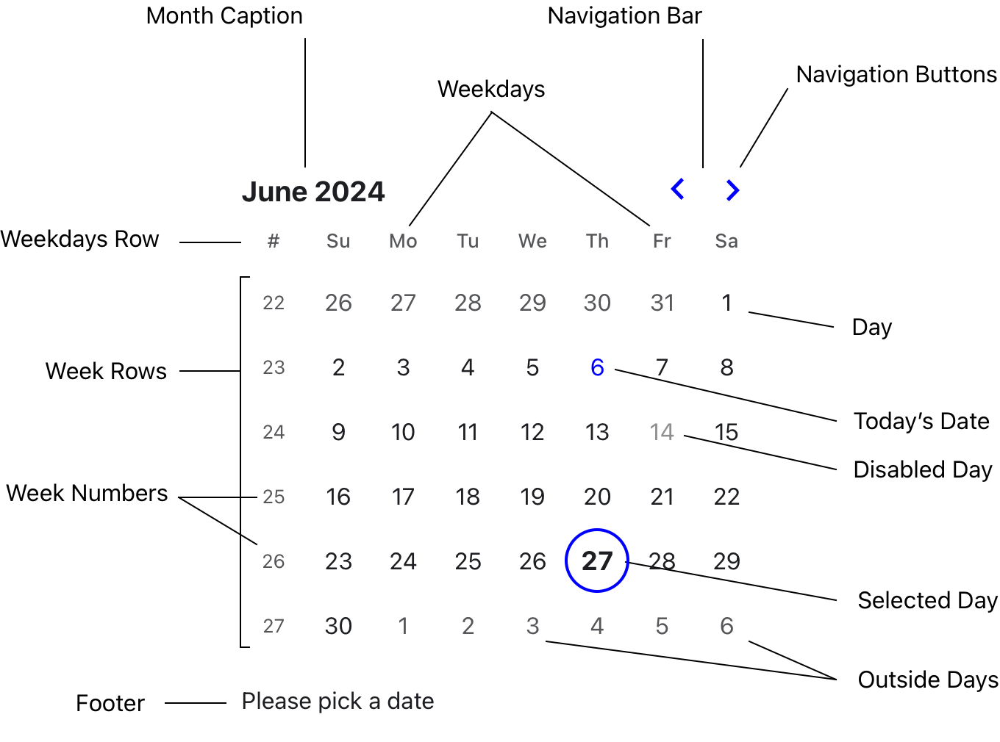

# DayPicker Anatomy

To better understand the documentation, familiarize yourself with the elements that compose DayPicker:

- **Navigation Bar**: Contains arrows to navigate between months.
- **Month Caption**: Displays the title of the current month.
- **Weekdays Row**: Shows the names of the weekdays.
- **Weeks**: Rows that display the days of the month.
- **Day**: Represents a day of the month, which can have different modifiers, such as:
  - **selected**: The day is selected.
  - **disabled**: The day is disabled.
  - **today**: The day is today.
  - **outside**: The day is outside the current month.
- **Footer**: An ARIA live region used to announce the selected date.

The UI elements are mapped to CSS classes. A complete list can be found in the [`UI`](../api/enumerations/UI.md) enum.

<BrowserWindow shadow={false}>
  

    <picture
      style={{
        maxWidth: 600,
        width: "100%",
        margin: "2em auto",
        display: "block"
      }}
    >
      <source
        media="(prefers-color-scheme: dark)"
        srcset="../img/anatomy-dark.png"
      />
      <source
        media="(prefers-color-scheme: light)"
        srcset="../img/anatomy-light.png"
      />
      
    </picture>
  

</BrowserWindow>
